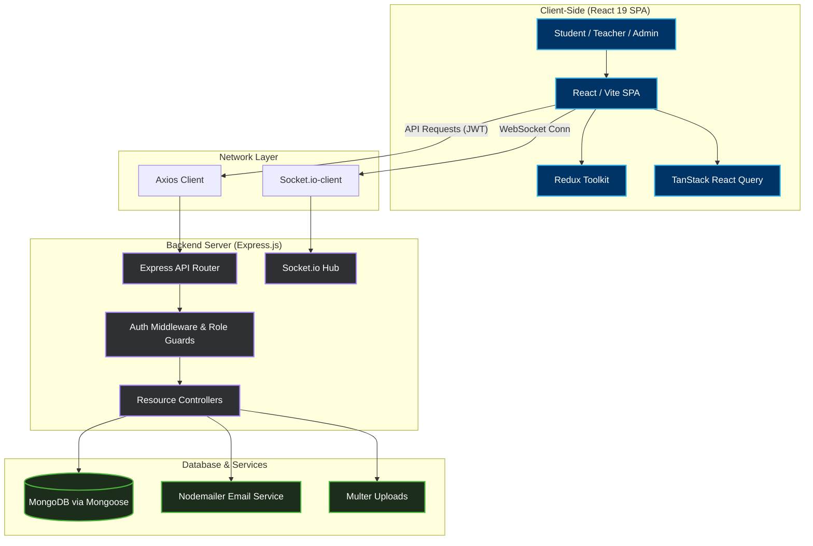
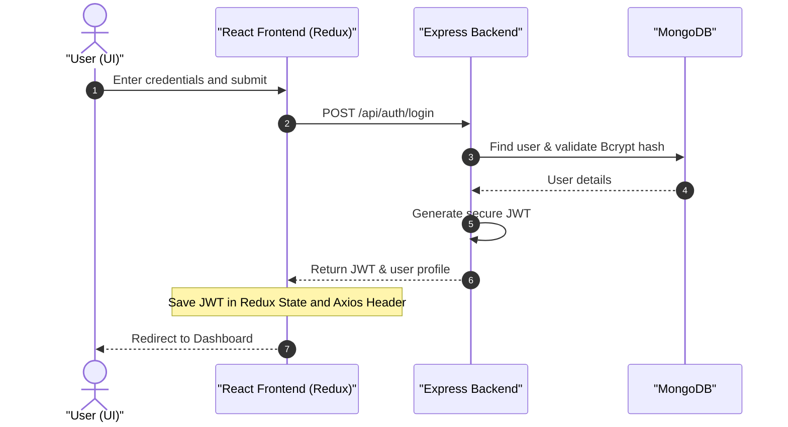

<div align="center">

```
╔══════════════════════════════════════════════════════════╗
║          SMART COLLEGE MANAGEMENT SYSTEM                 ║
║                      SCMS  ·  v1.0                       ║
╚══════════════════════════════════════════════════════════╝
```

**A state-of-the-art, feature-rich, and secure Full-Stack College Management System**  
designed for modern academic institutions.

Built using high-performance technologies like **React 19**, **Vite**, **TypeScript**,  
**Tailwind CSS v4**, and **Express.js** — SCMS provides an interactive, role-based  
ecosystem for Students, Teachers, and HODs / Administrators.

---

[](https://github.com/affanraza84/collegems)


</div>

---

## Contents

| # | Section |
|---|---------|
| 01 | [Key Features](#key-features) |
| 02 | [Tech Stack & Ecosystem](#tech-stack--ecosystem) |
| 03 | [Application Workflow](#application-workflow) |
| 04 | [Local Setup Guide](#local-setup-guide) |
| 05 | [Project Directory Structure](#project-directory-structure) |
| 06 | [Deploy on Render](#deploy-on-render) |
| 07 | [Contributing — SSOC '26](#contributing--ssoc-26) |
| 08 | [Author](#author) |

---

## Key Features

> SCMS is structured around role-based modules, ensuring that every user has a tailored experience specific to their tasks and permissions.

### `AUTH` — Authentication & Authorization

```
[ JWT ]  [ RBAC ]  [ BcryptJS ]  [ Secure Cookies ]
```

- **Secure JWT Authentication** — Industry-standard access token structure stored in global state.
- **Role-Based Access Control (RBAC)** — Fine-grained dashboard view filtering for Students, Teachers, and HODs.
- **Security Protocols** — Password hashing via BcryptJS, secure API middlewares, and cors configuration.
- **Password Policy** — Minimum 8 characters, at least one uppercase letter, one lowercase letter, one number, and one special character.

---

### `STUDENT` — Student Module

```
┌─────────────┐  ┌─────────────┐  ┌─────────────┐  ┌─────────────┐
│   Profile   │  │ Attendance  │  │ Assignments │  │  Finances   │
└─────────────┘  └─────────────┘  └─────────────┘  └─────────────┘
```

- **Comprehensive Profile** — Personal profile details, department information, and registration records.
- **Academics & Attendance** — Real-time view of class attendance percentages and detailed logs.
- **Assignments & Exams** — Track and submit assignments; view grades, exam schedules, and academic reports.
- **Finances** — Access detailed fee structures, outstanding balances, payment status, and download official fee receipts in PDF format.

---

### `TEACHER` — Teacher Module

```
┌─────────────┐  ┌─────────────┐  ┌─────────────┐  ┌─────────────┐
│  Academics  │  │ Attendance  │  │  Assignments│  │   Grading   │
└─────────────┘  └─────────────┘  └─────────────┘  └─────────────┘
```

- **Academics Control** — Create, manage, and assign courses/subjects to classes.
- **Attendance Registry** — Easy-to-use digital attendance marker with performance tracking.
- **Assignment Hub** — Create assignments, set deadlines, and grade student submissions directly.
- **Performance Grading** — Record and publish exam/test results seamlessly.

---

### `HOD` — HOD / Admin Module

```
┌─────────────┐  ┌─────────────┐  ┌─────────────┐  ┌─────────────┐
│User Control │  │  Academics  │  │  Financial  │  │  Approvals  │
└─────────────┘  └─────────────┘  └─────────────┘  └─────────────┘
```

- **User Control Panel** — Add, edit, or remove Student, Teacher, and Administrator accounts.
- **Academics Scheduling** — Oversee departments, class assignments, and courses.
- **Financial Registry** — Manage tuition fees, salaries, and system-wide transactions.
- **Approval Workflows** — Review leave requests, enrollment approvals, and administrative actions.

---

### `PARENT` — Parent Portal Module

- **Secure Login & Verification** — Verification matching for parent/guardian logins.
- **Student Progress Monitoring** — Real-time view of child's attendance stats, leave history, and academic results.
- **Financial Access** — View and track children's tuition fees and pending balances.

---

### `ANALYTICS` — Analytics & Reports

- **Visual Dashboards** — High-fidelity charts for tracking campus performance, outstanding fees, and monthly attendance rates.
- **Predictive Analytics (AI/ML)** — Identifies at-risk students through machine learning algorithms analyzing historical and ongoing student data to provide timely interventions.
- **Exporting Tools** — Download financial, academic, and attendance reports as PDF or Excel spreadsheets.

---

### `REALTIME` — Real-Time & AI Features

- **Live Notifications** — Event announcements and emergency notices sent instantly via Socket.io.
- **Smart Insights** — Under-the-hood preparation for smart insights such as performance tracking and attendance predictors.

---

## Tech Stack & Ecosystem

### Frontend

> A highly interactive and fluid Single Page Application (SPA) built with modern frontend best practices.

| Layer | Technology |
|-------|-----------|
| Library | React 19 + TypeScript |
| Build Tool | Vite |
| Styling | Tailwind CSS v4 + Material UI (MUI) |
| State Management | Redux Toolkit |
| Data Fetching | TanStack React Query |
| Data Visualization | Recharts |
| Real-time | Socket.io-client |
| Forms & Validation | React Hook Form + Yup |
| PDF Generation | jsPDF + html2canvas |

### Backend

> A reliable, scalable REST API built using the robust Node.js ecosystem.

| Layer | Technology |
|-------|-----------|
| Runtime | Node.js |
| Framework | Express.js v5 |
| Database | MongoDB via Mongoose (ODM) |
| Security | BcryptJS + JWT |
| Utilities | Nodemailer + Multer |

### Machine Learning Service

> A dedicated microservice for intelligent student analytics and risk prediction.

| Layer | Technology |
|-------|-----------|
| Runtime | Python |
| Framework | FastAPI |

---

## Application Workflow

### System Architecture



### Authentication Flow



### Persistent Session & Refresh Token Lifecycle

**Step 1 — Login/Register**
- Creates a unique `RefreshToken` document in the MongoDB session store.
- Tracks the user, SHA-256 hashed refresh token, device metadata (parsed from `User-Agent`), IP address, and token expiry.
- The plain refresh token is sent to the client via an HTTP-Only, Secure, `sameSite: strict` cookie.

**Step 2 — Access Token Refresh (Token Rotation)**
- When the client's short-lived Access Token expires, it calls `POST /api/auth/refresh` sending the cookie.
- The backend verifies the JWT, hashes it, checks the session in the DB, and verifies that it is active (not revoked or expired).
- If valid, a new Access Token and a new Refresh Token are generated. The old session is marked as revoked/used, and a new session is saved (Token Rotation).

**Step 3 — Token Reuse Detection (Automatic Compromise Recovery)**
- If an attacker intercepts a refresh token and attempts to reuse it, the backend identifies that the token hash matches a revoked/rotated session.
- Immediately, **all sessions** for that user are deleted/revoked, forcing a complete logout across all devices to prevent unauthorized access.

**Step 4 — Device Detection**
- A dedicated session middleware extracts device type (Desktop, Mobile, Tablet), browser, and OS from the request's `User-Agent` header and stores this information.

**Step 5 — Session Management APIs**

```
GET    /api/auth/sessions         → List all active sessions (flags isCurrent)
POST   /api/auth/logout-all       → Revoke all sessions, force logout everywhere
DELETE /api/auth/sessions/:id     → Revoke a specific session (remote logout)
```

**Step 6 — Password Change Security**
- When a user updates their password, all active sessions and refresh tokens are immediately deleted, forcing a re-login on all devices.

---

## Local Setup Guide

### Pre-requisites

```
Node.js   v18.x or above
MongoDB   Local instance or Atlas cluster URI
NPM / Yarn
Python    v3.10+ (for the Machine Learning service)
```

### 1. Backend Setup

```bash
# Navigate to the backend directory
cd collegems-server

# Install server dependencies
npm install

# Create local environment config
cp .env.example .env
```

Open `.env` and fill in your details:

```env
MONGO_URI=your_mongodb_connection_string
JWT_SECRET=your_super_secure_jwt_secret
PORT=5000
```

```bash
# Start the backend server in development mode
npm run dev
# → Running on http://localhost:5000
```

### 2. Frontend Setup

```bash
# Open a new terminal and navigate to the client directory
cd collegems-client

# Install client-side dependencies
npm install

# Create local environment config
cp .env.example .env
```

Check the backend URL setting inside `.env`:

```env
VITE_BACKEND_URL=http://localhost:5000/api
```

```bash
# Start the React/Vite development server
npm run dev
# → Running on http://localhost:5173
```

### 3. Machine Learning Service Setup

```bash
# Navigate to the ML service directory
cd collegems-ml-service

# Install required Python dependencies
pip install -r requirements.txt

# Start the FastAPI server
python main.py
# → Running on http://localhost:8000
```

### 4. Database Seeding & Demo Data

To help contributors quickly test the application locally without manually creating records, a comprehensive demo dataset is provided. This dataset populates Users, Courses, Attendance, Assignments, Results, Leaves, and Salaries.

```bash
# Ensure your local MongoDB instance is running.
# Verify .env in collegems-server has your correct MONGO_URI.

cd collegems-server
npm run seed

# You can run this anytime to reset/refresh the database with baseline demo data.
```

**Available Demo Accounts** — all accounts share the default password: `password123`

| Role | Name | Email |
|------|------|-------|
| HOD / Admin | Dr. Alice Vance | `hod@college.edu` |
| Teacher | Dr. David Evans | `david.evans@college.edu` |
| Teacher | Prof. Sarah Jenkins | `sarah.jenkins@college.edu` |
| Student | Alice Johnson | `alice.johnson@college.edu` |
| Student | Bob Smith | `bob.smith@college.edu` |

**Testing the Setup** — Log in as **Alice Johnson** (Student) to verify you can see published results, upcoming assignments (like the _Socket Programming Project_), and past attendance records. Then log in as **Dr. David Evans** (Teacher) to test grading submissions, managing leaves, and viewing salary records.

---

## Project Directory Structure

```
collegems/
├── assets/                         Shared README resources & graphics
│   └── scms_banner.png             High-fidelity dashboard banner
│
├── collegems-client/               React + Vite SPA
│   ├── public/                     Static public assets
│   └── src/
│       ├── api/                    Axios core and API query modules
│       ├── assets/                 Frontend asset graphics
│       ├── common-components-management/
│       ├── hod-components/         Admin/HOD specific UI elements
│       ├── teacher-components/     Teacher specific UI elements
│       ├── user-components/        Student specific UI elements
│       ├── pages/                  Layouts & Role dashboards
│       ├── routes/                 Route guarding and configuration
│       ├── App.tsx                 Main App Component
│       └── main.tsx                Client entry point
│
├── collegems-server/               Express API Backend
│   └── src/
│       ├── config/                 DB and application config
│       ├── controllers/            API business logic handlers
│       ├── middlewares/            Auth guards & validation middlewares
│       ├── models/                 Mongoose schemas
│       ├── routes/                 Express route endpoints
│       └── utils/                  Mailers and helper scripts
│       server.js                   Server entry point
│
├── collegems-ml-service/           Python FastAPI Microservice
│   ├── main.py                     ML service entry point
│   └── requirements.txt            Python dependencies
│
└── README.md
```

---


